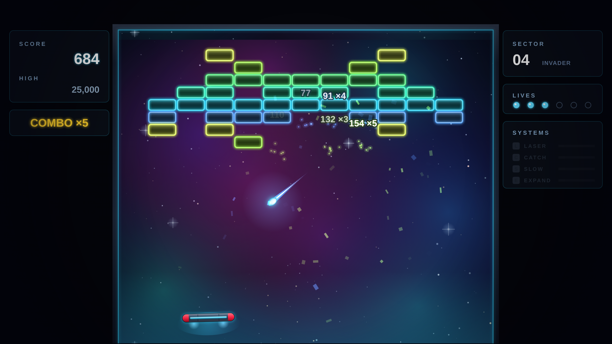

# NEONOID

A single-page Arkanoid tribute built as an experiment: does the
[Claude-of-Duty](https://github.com/mshumer/Claude-of-Duty) prompt pattern — build,
then `/loop` harsh sub-agent critics against screenshots until they're satisfied —
actually converge when the quality bar is reachable? (`prompt.md` has the adapted
prompt; the original aimed at Call of Duty and lost every blind comparison.)

**Play it: <https://melvincarvalho.github.io/neonoid/>**



**There are no assets.** Every pixel is canvas-drawn and every sound is Web Audio
synthesis. Two files: `index.html`, `game.js` (~1,000 lines). The only tool is a
browser.

```bash
# any static server, or just open index.html
python3 -m http.server 8000   # http://localhost:8000
```

Mouse or A/D to move, click/space to launch and fire. Six brick palettes across five
sector layouts (straight rows, checkerboard, pyramid, a space invader, a gold-pillared
vault), six power-ups (multiball, laser, expand, slow, catch, extra life), combo
scoring, silver two-hit and gold indestructible bricks.

## The experiment

The harness (`tools/capture.sh`) renders 8 named, deterministic shots via headless
Chromium — the game has a `?shot=` mode that steps a seeded simulation to a fixed
event ("9 bricks broken", "2 laser hits") and draws exactly one frame. Screenshots
are bit-reproducible, which the Claude-of-Duty README identifies as the precondition
for critics being useful at all.

Each round, three independent sub-agent critics with distinct lenses — composition/
color, game-feel juice, HUD/typography — scored the shots against a commercial bar
(Arkanoid: Eternal Battle, Shatter, Geometry Wars 3), tagged defects FRAME-RUINING /
MAJOR / MINOR, and demanded concrete fixes. All fixes were then applied by a single
owner (no parallel fan-out — the original repo's data shows split ownership of coupled
visual systems made things worse). Critics were told to grade against the bar, never
against improvement, and to call out claimed fixes that didn't land in the pixels.

## Scores

| round | composition | game-feel | HUD | mean |
|---|---|---|---|---|
| 1 (initial build) | 4.5 | 3.0 | 4.0 | **3.8** |
| 2 (neon bricks, VFX, rails, title band) | 6.0 | 5.5 | 6.5 | **6.0** |
| 3 (explosion scale, shake signature, nebula, popups) | 7.0 | 7.0 | 8.0 | **7.3** |

Round-3 verdicts, verbatim highlights: game-feel — "it finally crossed the line from
'screenshot of a game' to 'screenshot of a moment' … it's a real game now"; blind A/B
vs Shatter narrowed from ~90/10 to ~60/40 on kill frames. Composition — "photographs
like a product instead of a prototype"; A/B vs Eternal Battle ~65/35, "the clear
screen is legitimately shippable key art." HUD — "would pass cert review"; only the
wordmark flagged.

## Honest assessment

The bar was a modern commercial arcade remake. **It does not fully reach it** — but
unlike the FPS experiment, it got close enough that the critics started saying "ship."

What still loses the blind A/B, per the final panel:

- **The paddle silhouette.** Better-lit every round, still fundamentally a capsule.
- **Laser bolts** are dimmer than the wall they're shooting — the impacts landed,
  the projectile didn't.
- **No battle memory**: surviving bricks are factory-new mid-carnage.
- **The wordmark** is typed, not designed — the acknowledged ceiling of "no assets."
- **Explosions don't cast light** on the scene around them.

## What the experiment showed

1. **The critic loop converges when the bar is reachable**: 3.8 → 6.0 → 7.3 with no
   plateau yet, versus the FPS repo's 3.6 → 5.05 stall against an impossible bar.
2. **Critics catch fixes that exist in code but not in pixels** — a 160ms flash no
   still can capture, screen shake "only a diff tool can see," ball stretch nobody
   can perceive. That class of bug is invisible to the author.
3. **Critics disagree productively**: the feel critic wanted combo feedback in the
   arena, the HUD critic wanted the pill out of the ball lane; the synthesis (ride
   the multiplier on score popups) was better than either demand.
4. **Sequential single-owner passes** held up: no round ever broke a previous round's
   wins, which the original repo could not say about its parallel fan-out rounds.
